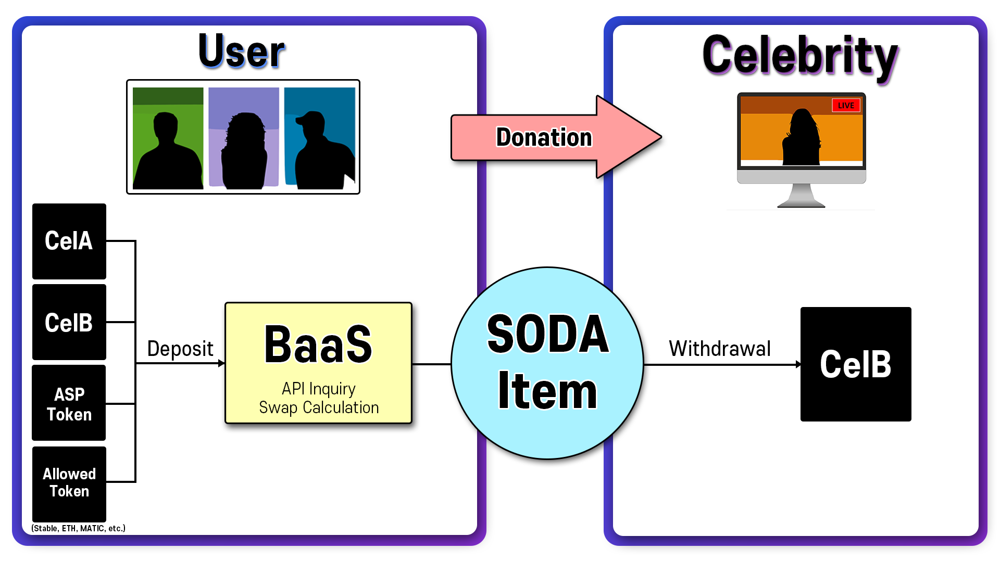

# 4.1. BaaS

BaaS(Blockchain as a Service)는 Celuv Play에서 구축한 새로운 블록체인 시스템으로, 자신의 지갑에 보유한 코인을 BaaS를 통하여 Celebrity에게 후원가능한 SODA Item으로 자동 스왑해주는 시스템입니다. BaaS에 사용가능한 토큰은 매우 다양한데, 몇 가지 스테이블 코인와 POPKON TV, Celuv TV를 포함한 100여개의 ASP 채널에서 상장된 토큰, 그리고 Celuv Play의 자체 토큰인 CelA, CelB 등이 있습니다.

