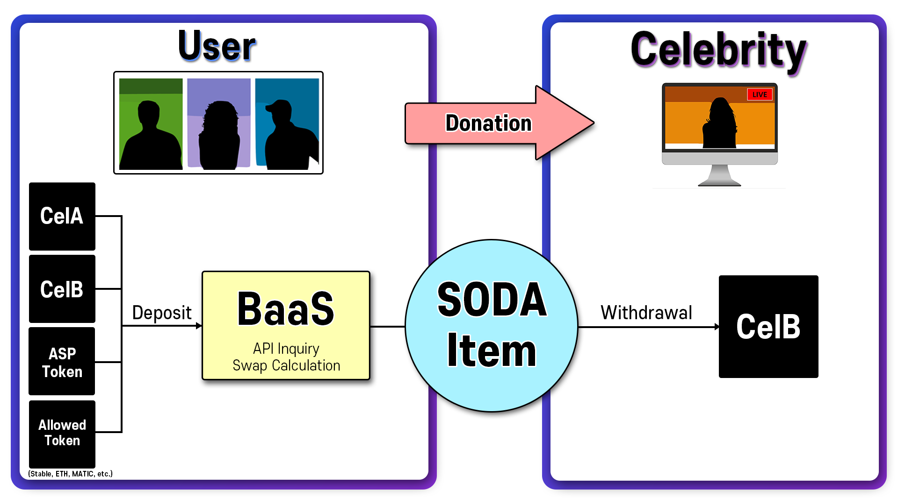

# 🟣 4. Blockchain System

## **4.1. BaaS**

***

BaaS(Blockchain as a Service)는 Celuv Play에서 구축한 새로운 블록체인 시스템으로, 자신의 지갑에 보유한 코인을 BaaS를 통하여 Celebrity에게 후원가능한 SODA Item으로 자동 스왑해주는 시스템입니다. BaaS에 사용가능한 토큰은 매우 다양한데, 몇 가지 스테이블 코인와 POPKON TV, Celuv TV를 포함한 100여개의 ASP 채널에서 상장된 토큰, 그리고 Celuv Play의 자체 토큰인 CelA, CelB 등이 있습니다.

## **4.2 Wallet**

***

Celuv Play 플랫폼 가입자에 대해 자동으로 폴리곤 기반의 유저 지갑 생성하여, 다양한 가상자산과 자신의 지갑이 결합될 수 있도록 합니다. 이는 유저의 국적과 관계없이 생성 가능하며, Stable Coin, ETH, MATIC과 더불어 Celuv Paly와 각종 ASP에서 사용되는 다양한 가상자산을 이용하여 Celuv Play 내 컨텐츠를 구입하고 판매할 수 있습니다.

\*\*\*\*

## **4.3 SODA Item**

***

SODA는 Celuv Play 내의 Item으로, Celebrity에게 후원을 하거나, 그 외 유료 서비스 이용에 사용하는 수단입니다. 개인 지갑에 입금한 가상자산에 대해 실시간 API를 반영한 환율로 SODA Item을 획득할 수 있습니다. 획득한 아이템은 CelB로 환전하여, CelB가 상장된 거래소를 통하여 자유롭게 출금할 수 있습니다.

\*\*\*\*

## **4.4. Swap**

***

기본적으로 지갑에 입금된 가상 자산은 BaaS 시스템을 통하여 SODA로 스왑이 가능하며, SODA 역시 CelB로 스왑이 가능합니다. 또한 CelA와 CelB간에도 자유롭게 Swap이 가능합니다. 토큰 간 자유로운 Swap을 통하여 원활한 순환구조를 만들 수 있습니다.

\*\*\*\*

## **4.5. NFT**

***

현재 NFT시장에는 무의미하고 무용한 NFT들이 넘쳐납니다. Celuv Play는 Celebrity를 소재로 한 웹툰에 대해 자체 IP를 보유함으로, 이를 이용한 NFT발행하여 유저들에게 보다 다양한 Utility를 제공하고자 합니다. 각 시즌 별로 출시되는 웹툰 등장인물을 NFT화 함으로써 유저들이 더욱 흥미를 가질 수 있을 것으로 보입니다. 등장인물의 NFT를 소유함으로써 이야기 속 주인공이 되는 것과 같은 기대감과 만족감을 가질 수 있을 것입니다.

NFT는 시즌별로 제작되어 민팅을 진행할 예정입니다. NFT 홀더에 대해 다양한 혜택을 제공할 예정인데, Staking에 대한 보상과 추가 NFT 에어드랍, 다음 NFT 시리즈 우선 구매권 등이 포함됩니다. 이 중 NFT 보유자에 대해 CelA와 CelB의 Reward를 지급함으로써, 토큰 경제 활성화에도 기여할 수 있습니다. 더 나아가, 또한 해당 NFT 세계관을 바탕으로 하는 Metaverse 제작으로의 발전을 도모할 수 있습니다. NFT 홀더에 대한 혜택은 로드맵에 지속적으로 추가될 것이며, NFT가치 상향을 도모합니다.
